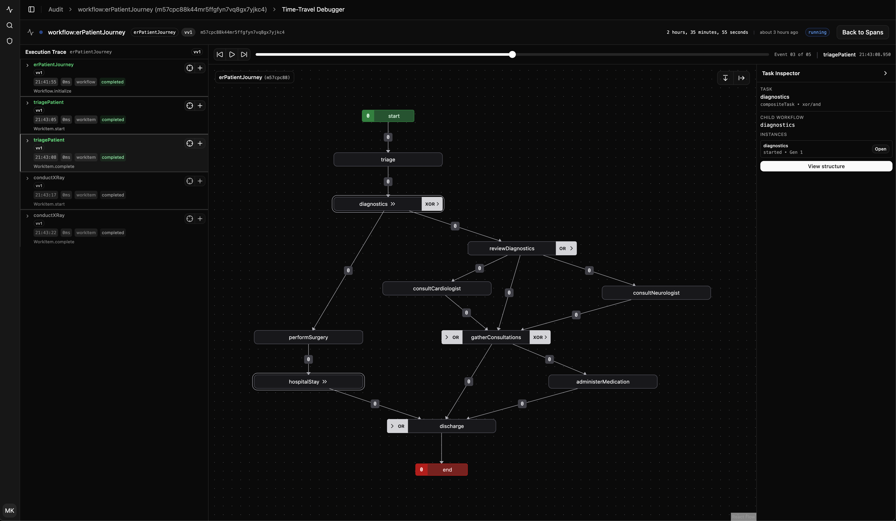

# Tasquencer

**Tasquencer** is a workflow engine for building **real, long-running business processes**—the kind that involve humans, automation, and AI working together over time.

It runs on **Convex**, is **type-safe by default**, and is designed for the **AI era**, where even “simple” tasks turn into implicit, multi-step flows.

---

## Why Tasquencer

Modern apps don’t just call APIs anymore.

They:

- draft with AI
- wait for humans
- branch on decisions
- retry, cancel, and recover
- survive deploys
- evolve over time

Most teams end up reinventing this with:

- flags and booleans
- background jobs
- ad-hoc queues
- fragile state machines

Tasquencer exists to give you a **clear, explicit, production-grade model** for this kind of work.

---

## The AI reality

With AI entering the workplace, something fundamental changed:

> **Every “atomic task” became a latent workflow.**

What used to be “a human does a thing” is now:

- AI prepares or analyzes
- humans review or correct
- systems react
- AI continues
- humans intervene again

These flows are often:

- implicit
- scattered
- hard to debug
- easy to break

Tasquencer makes those workflows **explicit, safe, and intentional**—without forcing you into generic workflow UIs.

---

## What Tasquencer gives you

- **Long-running workflows** (minutes → weeks)
- **Humans + AI + automation** in the same flow
- **Parallel steps, branching, cancellation**
- **Versioned workflows** that survive deploys
- **Safe retries and compensation**
- **Typed, explicit APIs**
- **Built-in observability and debugging**

All inside your application.

---

## Built for bespoke applications

Tasquencer is **not** about workflow dashboards.

It’s about enabling you to build:

- polished, domain-specific UIs
- apps where workflows are _felt_, not exposed

Your users see:

- “AI is preparing a draft”
- “Waiting for review”
- “Changes requested”
- “Ready to proceed”

Tasquencer makes sure that experience is **correct**, even when things get complicated.

---

## Coding-agent–first by design

Tasquencer is a **coding-agent–first framework**.

The API is intentionally:

- explicit
- deterministic
- typed
- auditable

This makes it suitable for:

- AI agents that orchestrate work
- human-in-the-loop systems
- mixed execution paths
- safe automation at scale

Agents can reason about workflows.
Humans can debug them.
Both can safely interact with the same system.

---

## Time-travel debugging (built in)

Tasquencer includes a **built-in time-travel debugger**.

You can:

- replay workflow execution
- scrub through time
- see parallel paths
- understand why something waited, fired, or never ran
- inspect nested workflows

This is critical for AI-assisted systems, where execution is non-linear and outcomes aren’t always obvious.

You don’t guess what happened—you **see it**.

---

## Domain-first (on purpose)

Tasquencer does **not** replace your business logic.

- Your **domain data** remains the source of truth
- Workflows orchestrate _when_ and _by whom_ work happens
- UI uses workflow state only for progress and affordances

This prevents workflows from becoming a hidden second business layer.

---

## Security is explicit

Any step a user can touch is treated as a **public API**:

- typed inputs
- explicit authorization
- clear trust boundaries

System-initiated work (AI callbacks, schedulers) uses a separate internal path.

Nothing is “magically safe.”
Everything is intentional.

---

## When to use Tasquencer

Tasquencer is a good fit for:

- approvals and reviews
- AI-assisted creation pipelines
- onboarding and lifecycle flows
- human-in-the-loop systems
- workflows that must survive time, failure, and change

It’s not meant for:

- simple CRUD
- batch processing
- streaming pipelines

---

## The goal

> **Make complex, AI-era business processes explicit, safe, and understandable—without turning your app into a mess.**

---

## Full workflow semantics

Tasquencer implements complete [YAWL](https://yawlfoundation.github.io/) semantics — a workflow model designed for real-world complexity.

This means you get:

- **Parallel paths** — fire multiple tasks at once, wait for all of them
- **Exclusive choice** — pick exactly one path based on conditions
- **Dynamic parallelism** — decide at runtime how many paths to take, and still synchronize correctly
- **Cancellation regions** — completing one task can automatically cancel others
- **Nested workflows** — workflows inside workflows, with proper state isolation
- **Multiple work items** — a single task can spawn and manage many units of work
- **Loops** — safely cycle back to earlier steps

Most workflow tools force you to pick between "simple but limited" or "powerful but complex."

Tasquencer gives you the semantics of a proper workflow engine, without exposing you to Petri net theory or academic jargon.

You describe what should happen. The engine handles the rest.

---

## FAQ

**"This looks overcomplicated."**

It is more ceremony than a simple state machine. That's intentional.

The complexity pays for itself in three ways:

1. **Coding agents love patterns.** Boilerplate isn't a burden when agents write it. Explicit, repeatable structure is exactly what they're good at.

2. **No artificial ceiling.** Tasquencer implements full YAWL semantics: OR-joins, nested workflows, dynamic composite tasks that late-bind their workflow type at runtime. When your "simple" flow grows complicated, you don't hit a wall.

3. **Data-driven means toolable.** Because workflows are data (not just code), you get: type safety across the wire, time-travel debugging, composability, and safe migrations between versions.

---

**"Do I really need this?"**

Probably not for everything.

If your flow is linear—do A, then B, then C—use a simpler approach. But note: even simple-looking workflows get complex fast when multiple actors are involved. "Human reviews AI draft" sounds simple until you add: revision requests, timeouts, reassignment, partial approvals, and escalation.

Tasquencer is for when:

- humans and AI hand off work to each other
- paths branch and merge based on runtime conditions
- steps run in parallel and need to synchronize
- flows must survive deploys, retries, and version changes

If you're unsure, you probably don't need it yet. When you do, you'll know.

---

**"Why YAWL? Sounds academic."**

YAWL has 20+ years of research and real-world use behind it. That matters for two reasons:

1. **The semantics are complete.** It handles edge cases (cancellation, synchronization, nested scopes) that simpler models punt on.

2. **LLMs understand it.** Every major model has YAWL papers, tutorials, and implementations in its training data. When you describe a pattern, the model knows what you mean.

Tasquencer doesn't expose the theory. You don't need to understand Petri nets. But the foundation is solid.

---

**"What about imperative workflow engines?"**

Imperative engines (define workflows as code, step by step) are great for pure automation—background jobs, data pipelines, scheduled tasks.

Tasquencer solves a different problem: orchestrating work between multiple actors (humans, AI, systems) where:

- work items sit in queues waiting for the right actor
- the same task can spawn multiple work items handled by different people
- humans and AI hand off based on conditions, not just sequence

If you need both, they integrate well. Use an imperative engine for automation. Use Tasquencer for the human/AI coordination layer on top.

---

**"Is the learning curve worth it?"**

The model is different from imperative code. There's a ramp-up.

But:

- The patterns are consistent. Once you learn one workflow, the next looks familiar.
- Coding agents flatten the curve. They understand the patterns and generate correct implementations.
- The abstractions match the problem. Work items, queues, and actors map directly to how human/AI collaboration actually works.

If your app involves humans and AI working together on shared processes, the investment pays off quickly.

---

## Get started

- Read [**Getting Started**](./docs/GETTING_STARTED.md)
- Learn the building blocks in [**Workflow Basics**](./docs/WORKFLOWS_BASIC.md)
- Connect workflows to real UIs with [**UI Integration**](./docs/UI_INTEGRATION.md)
- Explore queues and agents in [**Work Item Patterns**](./docs/WORK_ITEM_PATTERNS.md)
