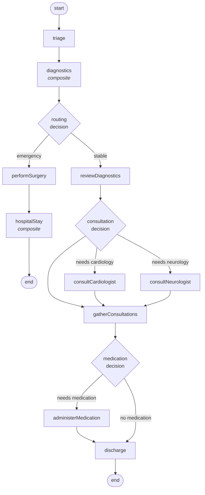
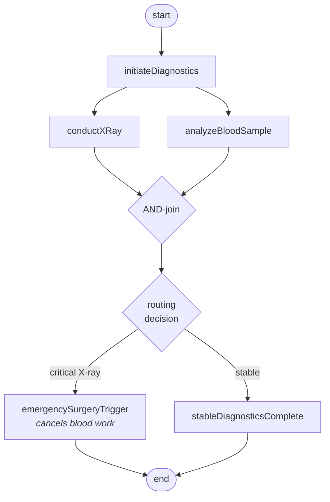
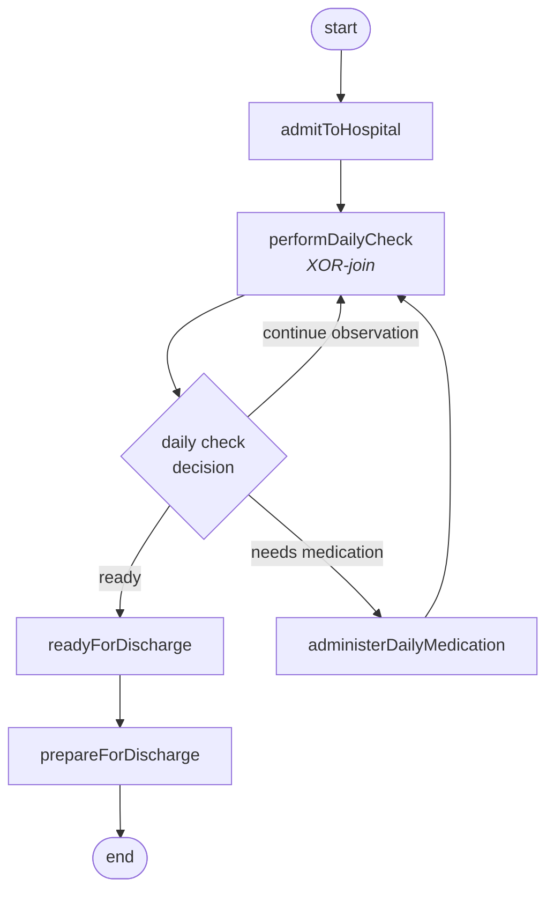

# Emergency Room (ER) Patient Journey Workflow Example

This example demonstrates a comprehensive healthcare workflow system for managing patient journeys through an emergency room, built with Convex and the Tasquencer workflow engine.

## Overview

The ER workflow manages the complete patient journey from initial triage through discharge, including:

- **Triage Assessment** - Prioritizing patients by severity (routine, urgent, critical)
- **Diagnostic Testing** - X-rays and blood work with parallel execution
- **Clinical Decision Making** - Routing based on findings (emergency surgery vs. standard care)
- **Specialist Consultations** - Cardiologist and neurologist evaluations
- **Hospitalization** - Patient admission and daily assessments
- **Medication Administration** - Initial, daily, and discharge medications
- **Discharge Preparation** - Documentation and follow-up instructions

## Setup

### 1. Start Convex Development Server

```bash
npx convex dev
```

This will set up the Convex backend and sync schema/functions.

### 2. Configure Better Auth

Set up environment variables for Better Auth. Follow the [Better Auth + Convex guide](https://labs.convex.dev/better-auth/framework-guides/tanstack-start#set-environment-variables) for detailed instructions.

Required environment variables in `.env.local`:

```env
CONVEX_DEPLOYMENT=your-deployment-id
VITE_CONVEX_URL=https://your-deployment.convex.cloud
VITE_CONVEX_SITE_URL=https://your-deployment.convex.site
SITE_URL=http://localhost:3000
```

### 3. Start the App and Register a User

```bash
pnpm dev
```

Navigate to `http://localhost:3000` and register your first user account.

### 4. Run Initial Setup Mutations

After registering, run these Convex mutations from the CLI to set up authorization:

```bash
# Make the first user a superadmin
npx convex run scaffold:scaffoldSuperadmin

# Set up ER workflow roles and groups
npx convex run workflows/er/authSetup:setupAuthErAuthorization
```

See [Convex CLI documentation](https://docs.convex.dev/cli#run-convex-functions) for more details on running functions.

---

## Workflow Architecture

### Three Interconnected Workflows

#### 1. Main Workflow: `erPatientJourney`

The primary workflow orchestrating the entire patient journey:



#### 2. Composite Workflow: `diagnostics`

Handles diagnostic testing in parallel with intelligent routing:



- Uses **AND-join** to collect both diagnostic results
- **Cancellation region** cancels blood work if X-ray shows critical findings

#### 3. Composite Workflow: `hospitalStay`

Manages inpatient care with assessment loops:



- Implements **XOR-join** on daily checks to prevent duplicate processing
- Creates loops based on daily assessment outcomes

---

## Work Items

Work items are human tasks requiring specific role authorizations:

| Work Item | Purpose | Required Scope |
|-----------|---------|----------------|
| `triagePatient` | Initial patient assessment | `er:triage:write` |
| `conductXRay` | X-ray imaging | `er:diagnostics:xray` |
| `analyzeBloodSample` | Blood analysis | `er:diagnostics:lab` |
| `reviewDiagnostics` | Clinical review of tests | `er:physician:write` |
| `specialistConsult` | Specialist evaluation | `er:specialist:consult` |
| `performSurgery` | Emergency surgical procedure | `er:specialist:surgery` |
| `admitToHospital` | Hospital admission | `er:support:admission` |
| `performDailyCheck` | Daily patient assessment | `er:nursing:write` |
| `administerMedication` | Initial medication | `er:nursing:write` |
| `administerDailyMedication` | Daily hospital medication | `er:nursing:write` |
| `prepareForDischarge` | Discharge documentation | `er:support:discharge` |

---

## Authorization Model

### Roles

| Role | Group | Permissions |
|------|-------|-------------|
| ER Triage Nurse | Nursing | Triage read/write, Nursing read |
| ER Floor Nurse | Nursing | Nursing read/write |
| ER Senior Doctor | Physicians | Physician read/write |
| ER Cardiologist | Specialists | Specialist consult, Cardiology |
| ER Neurologist | Specialists | Specialist consult, Neurology |
| ER Surgeon | Specialists | Specialist consult, Surgery |
| ER Radiologist | Diagnostics | X-ray diagnostics |
| ER Lab Technician | Diagnostics | Lab diagnostics |
| ER Admissions Clerk | Support | Patient admission |
| ER Discharge Coordinator | Support | Patient discharge |

### Groups

- **er_nursing** - Triage and Floor Nurses
- **er_physicians** - Senior Doctors
- **er_specialists** - Cardiologists, Neurologists, Surgeons
- **er_diagnostics** - Radiologists and Lab Technicians
- **er_support** - Admissions and Discharge Coordinators

---

## UI Integration

### Pages

| Route | Purpose |
|-------|---------|
| `/er` | Patient list with status badges |
| `/er/new` | Admit new patient form |
| `/er/$patientId` | Patient journey details |
| `/er/queue` | Work queue (available tasks) |
| `/er/tasks/*` | Task-specific forms |
| `/admin/*` | User and role management |
| `/audit` | Workflow tracing and visualization |

### Task Flow

1. **Work Queue** - Users see available tasks filtered by their roles
2. **Claim Task** - User claims a task from the queue
3. **Complete Task** - User fills form and submits
4. **Workflow Advances** - Tasquencer routes to next step based on outcome

### Patient Journey View

The patient detail page dynamically renders views based on workflow status:
- TriageView, DiagnosticsView, EmergencySurgeryView
- ReviewView, ConsultationView, TreatmentView
- HospitalStayView, DischargedView

---

## Tech Stack

| Layer | Technology |
|-------|------------|
| Frontend | React 19 + TanStack Router |
| Styling | Tailwind CSS + Radix UI |
| Backend | Convex |
| Authentication | Better Auth |
| Workflows | Tasquencer |
| Authorization | Role-based with scope modules |

---

## Key Files

```
convex/
├── workflows/er/
│   ├── definition.ts      # Workflow definitions
│   ├── schema.ts          # Database schema
│   ├── scopes.ts          # Permission scopes
│   ├── authorization.ts   # Auth service setup
│   ├── authSetup.ts       # Role/group initialization
│   ├── workflows/         # Workflow implementations
│   ├── workItems/         # Human task definitions
│   ├── domain/            # Business logic services
│   ├── application/       # Application layer
│   ├── api/               # Convex API functions
│   └── db/                # Database operations
├── scaffold.ts            # Superadmin setup
└── auth.ts                # Better Auth configuration

src/
├── routes/
│   └── _app/er/           # ER workflow pages
└── components/            # Reusable UI components
```
